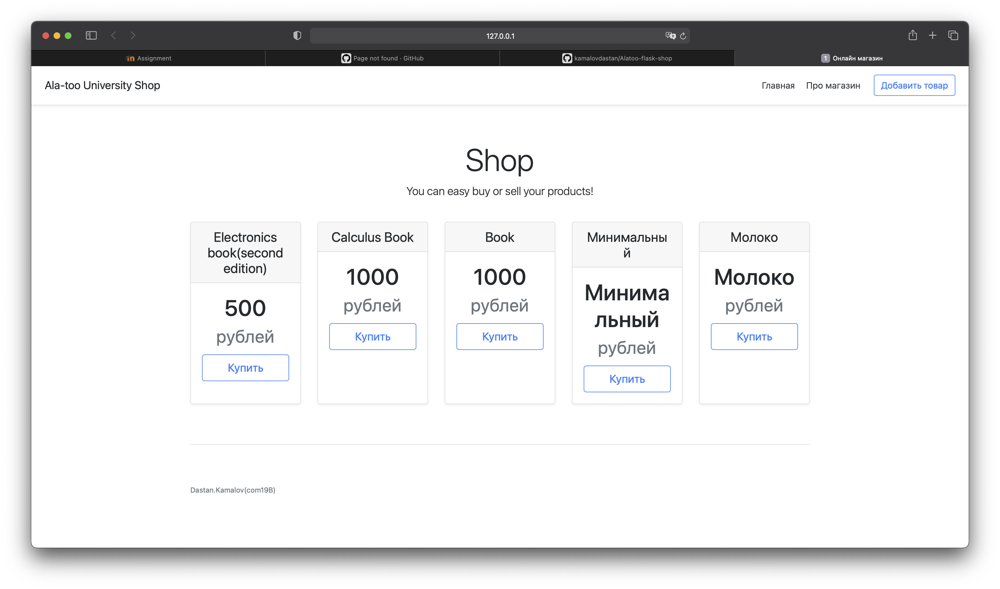
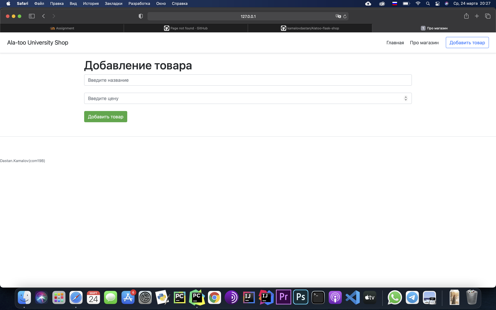

# Alatoo-flask-shop

#Deskription:

In my project you can buy or sell book or another something, and i connected payment system name fondy.ua

This project i used Python(Flask), Rest, Database(sqlite) and university project

#Photo

